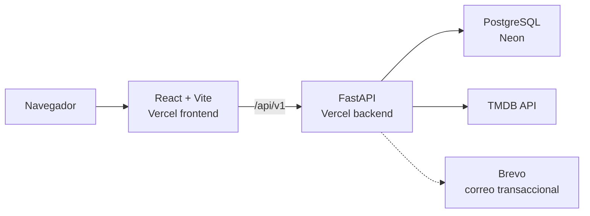

# Watch Later Universal

Aplicación web para descubrir películas y series, guardarlas para después y organizar una biblioteca personal. El proyecto integra información de TMDB con autenticación propia, persistencia en PostgreSQL y una interfaz responsive construida con React.

**Demo:** [watch-later-universal-six.vercel.app](https://watch-later-universal-six.vercel.app/)

> El flujo de producción está conectado con Vercel, Neon y Brevo, incluyendo el envío real de correos de verificación y recuperación de contraseña.

## Funcionalidades

- Búsqueda paginada de películas y series mediante TMDB.
- Fichas con sinopsis, calificación, fecha, póster y plataformas disponibles.
- Registro, verificación de correo, inicio y cierre de sesión.
- Sesiones con access tokens y refresh tokens rotatorios almacenados en cookies `HttpOnly`.
- Recuperación segura de contraseña con tokens temporales de un solo uso.
- Biblioteca personal persistente en PostgreSQL.
- Estados de visualización: por ver, viendo, completado, pausado y abandonado.
- Favoritos y calificación interactiva de cinco estrellas en incrementos de media estrella.
- Filtros, ordenamiento y paginación de la biblioteca.
- Indicadores de contenido ya guardado en resultados y detalles.
- Diseño responsive para escritorio y dispositivos móviles.

## Arquitectura



El frontend y el backend viven en el mismo repositorio y se despliegan como Vercel Services bajo un único dominio. Las rutas `/api/*` llegan a FastAPI y las demás rutas se sirven desde la SPA de Vite.

## Tecnologías

### Frontend

- React 19 y TypeScript.
- Vite 8.
- React Router.
- TanStack Query.
- CSS Modules.
- Vitest y Testing Library.
- Oxlint.

### Backend

- Python 3.13 y FastAPI.
- SQLAlchemy 2 y Alembic.
- PostgreSQL con psycopg 3.
- Pydantic Settings.
- Argon2 para contraseñas.
- JWT con rotación y revocación de refresh tokens.
- HTTPX para integraciones externas.
- Pytest.

### Infraestructura

- Vercel Services para frontend y API.
- Neon para PostgreSQL administrado.
- TMDB como catálogo de contenido.
- Brevo para correo transaccional.

## Seguridad

- Contraseñas protegidas con Argon2; nunca se almacenan en texto plano.
- Refresh tokens aleatorios almacenados como hashes y rotados en cada renovación.
- Cookies `HttpOnly`, `Secure` y con `SameSite` configurable.
- Tokens de verificación y recuperación con expiración, hash y uso único.
- Respuestas genéricas en recuperación y reenvío para reducir enumeración de cuentas.
- Variables sensibles fuera de Git y configuradas mediante variables de entorno.
- Consultas construidas con SQLAlchemy y validación de entrada con Pydantic.

## Ejecución local en Windows

### Requisitos

- Python 3.13.
- Node.js 24 LTS.
- PostgreSQL 18.
- Git.
- Un API Read Access Token de TMDB.

No se requiere WSL, Docker ni una máquina virtual.

### Backend

Desde la raíz del repositorio:

```powershell
cd backend

py -3.13 -m venv .venv
& .\.venv\Scripts\python.exe -m pip install -r requirements.txt

Copy-Item .env.example .env
```

Completa `backend/.env` con tus credenciales locales y aplica las migraciones:

```powershell
& .\.venv\Scripts\alembic.exe upgrade head
& .\.venv\Scripts\python.exe -m uvicorn app.main:app --reload
```

La API estará disponible en `http://127.0.0.1:8000` y su documentación interactiva en `http://127.0.0.1:8000/docs`.

### Frontend

En otra terminal:

```powershell
cd frontend

& "C:\Program Files\nodejs\npm.cmd" install
Copy-Item .env.example .env
& "C:\Program Files\nodejs\npm.cmd" run dev
```

El frontend estará disponible en `http://localhost:5173`.

## Variables de entorno

Los archivos `.env` están excluidos de Git. Usa los archivos `.env.example` como plantilla.

Variables principales del backend:

| Variable | Uso |
| --- | --- |
| `TMDB_ACCESS_TOKEN` | API Read Access Token de TMDB. |
| `DATABASE_URL` | URL completa de PostgreSQL en entornos cloud. |
| `DATABASE_HOST`, `DATABASE_PORT`, `DATABASE_NAME`, `DATABASE_USER`, `DATABASE_PASSWORD` | Configuración alternativa para PostgreSQL local. |
| `JWT_SECRET_KEY` | Firma de tokens de acceso. |
| `FRONTEND_BASE_URL` | Base de enlaces de verificación y recuperación. |
| `CORS_ALLOWED_ORIGINS` | Orígenes permitidos por la API. |
| `EMAIL_DELIVERY_MODE` | `console` durante desarrollo o `brevo` para envío real. |
| `BREVO_API_KEY` | Credencial de Brevo; debe mantenerse secreta. |

Variable principal del frontend:

| Variable | Uso |
| --- | --- |
| `VITE_API_BASE_URL` | Base pública de la API, por ejemplo `/api/v1` en producción. |

## Pruebas y calidad

Backend:

```powershell
cd backend
& .\.venv\Scripts\python.exe -m pytest -q
```

Frontend:

```powershell
cd frontend
& "C:\Program Files\nodejs\npm.cmd" test
& "C:\Program Files\nodejs\npm.cmd" run build
& "C:\Program Files\nodejs\npm.cmd" run lint
```

## Migraciones

Alembic mantiene el esquema de PostgreSQL de forma versionada:

```powershell
cd backend
& .\.venv\Scripts\alembic.exe current
& .\.venv\Scripts\alembic.exe upgrade head
```

## Mejoras futuras

- Filtrar por plataforma de streaming y disponibilidad.
- Estadísticas personales: cantidad completada, géneros frecuentes y calificación promedio.

## Fuentes de datos

Este producto utiliza la API de TMDB, pero no está respaldado ni certificado por TMDB.
